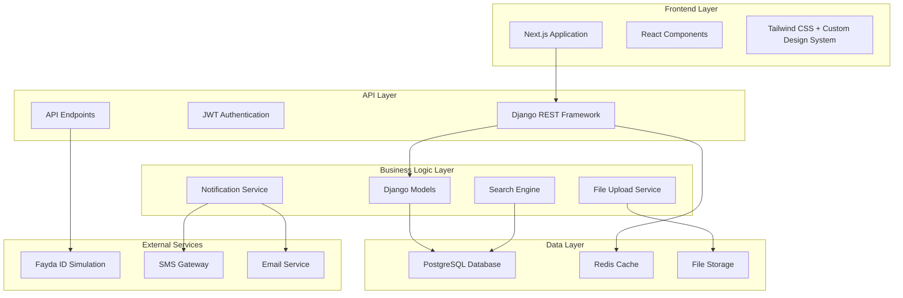

# Design Document

## Overview

The Ethiopian Domestic & Skilled Worker Platform is designed as a modern, scalable web application using a decoupled architecture with Django REST Framework backend, React/Next.js frontend, and PostgreSQL database. The system emphasizes Ethiopian cultural context, mobile-first design, and integration readiness with government systems like LMIS and Fayda ID verification.

The platform serves three primary user types: Workers seeking employment, Employers posting jobs, and Administrators managing the platform. The design prioritizes user experience, data security, and cultural relevance while maintaining technical excellence and scalability.

## Architecture

### System Architecture



### Technology Stack

**Backend:**
- Django 4.2+ with Django REST Framework
- PostgreSQL 14+ for primary database
- Redis for caching and session management
- Celery for background tasks
- JWT for authentication
- Django Channels for real-time notifications

**Frontend:**
- Next.js 14+ with App Router
- React 18+ with TypeScript
- Tailwind CSS with custom Ethiopian design system
- React Query for state management
- React Hook Form for form handling
- Next.js Image optimization

**Infrastructure:**
- Docker containerization
- Nginx reverse proxy
- AWS S3 or local storage for file uploads
- PostgreSQL with proper indexing strategy

## Components and Interfaces

### Core Models

#### User Model
```python
class User(AbstractUser):
    user_type = models.CharField(choices=[('worker', 'Worker'), ('employer', 'Employer'), ('admin', 'Admin')])
    phone_number = models.CharField(max_length=15)
    is_verified = models.BooleanField(default=False)
    created_at = models.DateTimeField(auto_now_add=True)
    updated_at = models.DateTimeField(auto_now=True)
```

#### Worker Profile Model
```python
class WorkerProfile(models.Model):
    user = models.OneToOneField(User, on_delete=models.CASCADE)
    fayda_id = models.CharField(max_length=20, unique=True)
    full_name = models.CharField(max_length=100)
    age = models.IntegerField()
    place_of_birth = models.CharField(max_length=100)
    region_of_origin = models.CharField(max_length=50)
    current_location = models.CharField(max_length=100)
    emergency_contact_name = models.CharField(max_length=100)
    emergency_contact_phone = models.CharField(max_length=15)
    languages = models.JSONField()  # Array of language proficiency
    education_level = models.CharField(max_length=50)
    religion = models.CharField(max_length=50)
    working_time = models.CharField(choices=[('full_time', 'Full-time'), ('part_time', 'Part-time'), ('live_in', 'Live-in')])
    skills = models.JSONField()  # Array of skills
    years_experience = models.IntegerField()
    profile_photo = models.ImageField(upload_to='profiles/')
    certifications = models.FileField(upload_to='certifications/', blank=True)
    background_check_status = models.BooleanField(default=False)
    is_approved = models.BooleanField(default=False)
    rating = models.DecimalField(max_digits=3, decimal_places=2, default=0.00)
```

#### Job Posting Model
```python
class JobPosting(models.Model):
    employer = models.ForeignKey(User, on_delete=models.CASCADE)
    title = models.CharField(max_length=200)
    description = models.TextField()
    location = models.CharField(max_length=100)
    salary_min = models.DecimalField(max_digits=10, decimal_places=2)
    salary_max = models.DecimalField(max_digits=10, decimal_places=2)
    required_skills = models.JSONField()
    working_arrangement = models.CharField(max_length=50)
    is_active = models.BooleanField(default=True)
    created_at = models.DateTimeField(auto_now_add=True)
```

### API Endpoints Design

#### Authentication Endpoints
- `POST /api/auth/register/` - User registration
- `POST /api/auth/login/` - User login
- `POST /api/auth/refresh/` - Token refresh
- `POST /api/auth/logout/` - User logout
- `POST /api/auth/password-reset/` - Password reset

#### Worker Endpoints
- `GET /api/workers/` - List workers with filtering
- `POST /api/workers/` - Create worker profile
- `GET /api/workers/{id}/` - Get worker details
- `PUT /api/workers/{id}/` - Update worker profile
- `POST /api/workers/{id}/upload-photo/` - Upload profile photo
- `POST /api/workers/{id}/upload-certification/` - Upload certification

#### Employer Endpoints
- `GET /api/jobs/` - List job postings
- `POST /api/jobs/` - Create job posting
- `GET /api/jobs/{id}/` - Get job details
- `PUT /api/jobs/{id}/` - Update job posting
- `POST /api/jobs/{id}/shortlist/` - Shortlist worker

#### Search Endpoints
- `GET /api/search/workers/` - Advanced worker search
- `GET /api/search/jobs/` - Job search
- `GET /api/filters/` - Get available filter options

### Frontend Component Architecture

#### Page Components
- `HomePage` - Landing page with search functionality
- `WorkerDirectory` - Grid view of worker profiles
- `WorkerProfile` - Detailed worker profile view
- `JobListings` - List of available jobs
- `Dashboard` - Role-specific dashboard
- `AdminPanel` - Administrative interface

#### Shared Components
- `SearchFilters` - Advanced filtering component
- `ProfileCard` - Worker profile card component
- `JobCard` - Job posting card component
- `NavigationBar` - Main navigation
- `AuthForms` - Login/registration forms

#### Ethiopian Design System
- Custom color palette based on Ethiopian flag colors
- Typography system with Amharic font support
- Icon library with Ethiopian cultural context
- Grid system optimized for profile displays
- Mobile-first responsive breakpoints

## Data Models

### Database Schema Design

#### Core Tables
1. **users** - Base user authentication and profile
2. **worker_profiles** - Detailed worker information
3. **employer_profiles** - Employer/business information
4. **job_postings** - Job listings and requirements
5. **applications** - Worker job applications
6. **shortlists** - Employer worker shortlists
7. **messages** - Communication between users
8. **notifications** - System notifications

#### Reference Tables
1. **regions** - Ethiopian administrative regions
2. **skills** - Standardized skill categories
3. **languages** - Supported languages with proficiency levels
4. **education_levels** - Education classification system

#### Indexing Strategy
- Composite indexes on frequently searched fields (region + skills + experience)
- Full-text search indexes on worker profiles and job descriptions
- Geographic indexes for location-based searches
- Performance indexes on foreign keys and date fields

### Data Validation Rules

#### Fayda ID Validation
- Format: 16-digit numeric string
- Checksum validation algorithm
- Uniqueness constraint across platform
- Integration placeholder for government verification API

#### Profile Completeness Scoring
- Mandatory fields: 60% weight
- Optional fields: 25% weight
- Verification status: 15% weight
- Minimum 80% completion required for profile activation

## Error Handling

### API Error Response Format
```json
{
  "error": {
    "code": "VALIDATION_ERROR",
    "message": "Profile validation failed",
    "details": {
      "fayda_id": ["Invalid format"],
      "phone_number": ["Required field"]
    },
    "timestamp": "2024-01-15T10:30:00Z"
  }
}
```

### Error Categories
1. **Validation Errors** - Input validation failures
2. **Authentication Errors** - Login/permission issues
3. **Business Logic Errors** - Application rule violations
4. **System Errors** - Technical failures
5. **Integration Errors** - External service failures

### Error Handling Strategy
- Graceful degradation for non-critical features
- User-friendly error messages in local languages
- Comprehensive logging for debugging
- Automatic retry mechanisms for transient failures
- Fallback options for external service dependencies

## Testing Strategy

### Backend Testing
1. **Unit Tests**
   - Model validation and business logic
   - API endpoint functionality
   - Authentication and authorization
   - Search and filtering algorithms

2. **Integration Tests**
   - Database operations and transactions
   - External service integrations
   - File upload and processing
   - Email and SMS notifications

3. **Performance Tests**
   - Database query optimization
   - API response times
   - Concurrent user handling
   - Search performance with large datasets

### Frontend Testing
1. **Component Tests**
   - React component rendering
   - User interaction handling
   - Form validation and submission
   - Responsive design verification

2. **End-to-End Tests**
   - Complete user workflows
   - Cross-browser compatibility
   - Mobile device testing
   - Accessibility compliance

3. **Visual Regression Tests**
   - Ethiopian design system consistency
   - Layout integrity across devices
   - Cultural appropriateness of UI elements

### Security Testing
1. **Authentication Security**
   - JWT token validation
   - Session management
   - Password security requirements
   - Role-based access control

2. **Data Protection**
   - Input sanitization
   - SQL injection prevention
   - File upload security
   - Personal data encryption

3. **API Security**
   - Rate limiting implementation
   - CORS configuration
   - Request validation
   - Error information disclosure

### Ethiopian Context Testing
1. **Localization Testing**
   - Amharic text rendering
   - Right-to-left language support
   - Cultural appropriateness
   - Regional data accuracy

2. **Integration Testing**
   - Fayda ID validation simulation
   - LMIS data format compliance
   - Ethiopian phone number formats
   - Local payment method integration

### Performance Benchmarks
- Page load time: < 3 seconds on 3G connection
- Search response time: < 2 seconds for 10,000+ profiles
- Concurrent users: Support for 1,000+ simultaneous users
- Database queries: < 100ms for standard operations
- File uploads: Support up to 10MB with progress indication